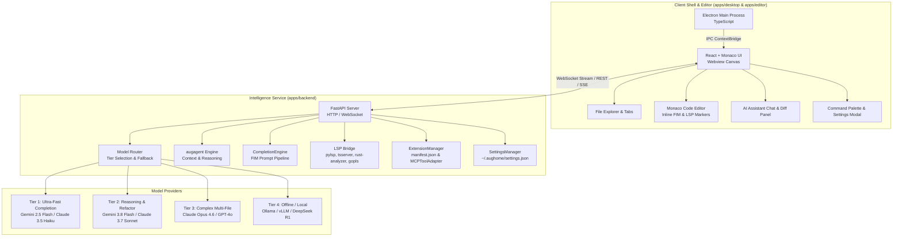

# AugHome IDE

<div align="center">

**An AI-native, open-source code editor powered by Augagent**

[](https://opensource.org/licenses/MIT)
[](https://github.com/Augmencord/AugHome)
[](https://github.com/Augmencord/augagent)
[](https://github.com/Augmencord/AugHome)
[](https://github.com/Augmencord/AugHome/actions)

</div>

---

## 🌟 Overview

**AugHome IDE** is a modern, extensible, open-source code editor built from the ground up for deep AI integration. Powered by [`augagent`](https://github.com/Augmencord/augagent), AugHome integrates contextual multi-file reasoning, inline agentic code completion (FIM), unified diff visualization, a local Language Server Protocol (LSP) bridge, and a modular Model Context Protocol (MCP) extension system directly into a responsive developer workspace.

```text
┌────────────────────────────────────────────────────────────────────────┐
│ ⚡ AugHome IDE  [File] [Edit] [Selection] [View] [Terminal] [Help]       │
├────┬───────────────────────┬───────────────────────────┬───────────────┤
│ 📁 │ 📁 EXPLORER           │ server.py                 │ ⚡ AugAgent   │
│    │  ▼ apps/backend       │ 1 from fastapi import ... │               │
│ 🔍 │    📄 server.py       │ 2                         │ "Fix errors   │
│    │    📄 lsp_bridge.py   │ 3 app = FastAPI()         │  in server.py"│
│ ⎇  │  ▼ apps/editor        │ 4                         │               │
│    │    📄 App.tsx         │ 5 @app.get("/v1/lsp/...") │ Proposing fix │
│ 🧩 │  ▼ extensions         │ 6 def lsp_diagnostics():  │ + diff patch  │
│    │    📁 python-support  │ 7     ...                 │               │
├────┴───────────────────────┴───────────────────────────┴───────────────┤
│ ⌨ Terminal: python server.py — Running on http://127.0.0.1:8000        │
└────────────────────────────────────────────────────────────────────────┘
```

### Key Capabilities

- **AI-Native Context Engine**: Built-in AST-aware repository indexing and semantic symbol graph mapping powered by `augagent`.
- **Fill-In-The-Middle (FIM) Inline Completion**: Sub-300ms ghost text suggestions supporting Codestral, Qwen 2.5 Coder, StarCoder, and Gemini prompt templates.
- **Language Server Protocol (LSP) Integration**: Stdio JSON-RPC 2.0 lifecycle management, diagnostics squiggly underlines, hover documentation, go-to-definition, and symbol renaming.
- **Model Context Protocol (MCP) Extensions**: Declarative `manifest.json` extensions connecting external MCP tool servers, custom color themes, and language grammars.
- **Hybrid Local & Cloud Routing**: Seamlessly routes tasks between ultra-fast local models (Ollama, vLLM) and leading frontier cloud models (Gemini, Claude, GPT-4o, DeepSeek).
- **Command Palette & VS Code Keybindings**: Fast `Ctrl+Shift+P` command execution, `Ctrl+,` preferences UI, and customizable shortcuts saved in `~/.aughome/settings.json`.

---

## 🏗️ Architecture

AugHome is architected as an npm workspace monorepo decoupled into a native Electron shell, a React + Monaco rendering layer, and a Python FastAPI intelligence backend hosting `augagent`.



---

## 📊 Model Support Matrix

AugHome employs an intelligent tier-based routing strategy allowing developers to optimize for cost, latency, or maximum reasoning capability.

| Tier | Category | Recommended Models | Primary Use Cases | Streaming Latency |
| :--- | :--- | :--- | :--- | :--- |
| **Tier 1** | Ultra-Fast Inline | Gemini 2.5 Flash, Claude 3.5 Haiku, DeepSeek V3 | Tab completion, inline lint diagnostics, docstring generation | `< 150ms` |
| **Tier 2** | Code Generation & Editing | Gemini 3.8 Flash, Claude 3.7 Sonnet, GPT-4o-mini | In-editor diff generation, single-file refactoring, unit test authoring | `< 400ms` |
| **Tier 3** | Deep Reasoning & Multi-File | Claude Opus 4.6, GPT-4o, DeepSeek R1 | Cross-repository architectural refactoring, complex bug hunting | `< 1200ms` |
| **Tier 4** | Local & Offline (Privacy) | Ollama (Qwen 2.5 Coder, Llama 3.3), vLLM | 100% offline, zero-cloud environments, proprietary codebases | Hardware dependent |

---

## 🚀 Getting Started

### Prerequisites

- **Node.js**: `v20.0.0` or higher
- **npm**: `v10.0.0` or higher
- **Python**: `3.10` or higher
- **Git**

### Installation

```bash
# 1. Clone the repository
git clone https://github.com/Augmencord/AugHome.git
cd AugHome

# 2. Install workspace dependencies
npm install

# 3. Setup Python backend and augagent dependencies
npm run setup:python

# 4. Start the development environment (Electron + React + Backend)
npm run dev
```

### Running Tests

```bash
# Run all workspace Node.js integration tests (38 tests)
npm run test

# Run backend Python unit tests (86 tests)
npm run test:backend
```

---

## ⚙️ Model & API Configuration

AugHome reads API keys from environment variables or through the interactive Settings UI (`Ctrl+,`):

```bash
# Optional cloud provider keys
export GEMINI_API_KEY="your-gemini-key"
export ANTHROPIC_API_KEY="your-anthropic-key"
export OPENAI_API_KEY="your-openai-key"

# Local Ollama endpoint (Default: http://127.0.0.1:11434)
export OLLAMA_HOST="http://127.0.0.1:11434"
```

Configuration is persisted locally to `~/.aughome/settings.json`:

```json
{
  "editor.theme": "aughome-dark",
  "editor.fontSize": 13,
  "editor.tabSize": 2,
  "editor.minimap": true,
  "editor.inlineSuggest": true,
  "ai.selectedModel": "gemini-2.5-flash",
  "ai.autoCompleteDebounceMs": 300
}
```

---

## 🧩 Extension System

AugHome extensions live in the `extensions/` workspace directory or `~/.aughome/extensions/`. Each extension defines a declarative `manifest.json`:

```json
{
  "id": "my-custom-tools",
  "name": "Custom Development Tools",
  "version": "0.1.0",
  "description": "Extends AugHome with project-specific MCP tool servers",
  "publisher": "my-team",
  "contributes": {
    "commands": [
      { "command": "tools.runAnalysis", "title": "Project: Run Deep Static Analysis" }
    ],
    "themes": [
      { "id": "my-theme", "label": "Custom Slate", "uiTheme": "vs-dark" }
    ],
    "languages": [
      { "id": "rust", "extensions": [".rs"] }
    ],
    "mcpServers": {
      "analysis-server": {
        "command": "python",
        "args": ["-m", "analysis_mcp_server"]
      }
    }
  }
}
```

### Bundled Extensions

- **`python-support`**: Python language syntax, AST diagnostics, lint commands, and `pylsp` integration.
- **`theme-aughome-dark`**: Signature high-contrast dark theme with JetBrains Mono styling.
- **`git-lens`**: Inline commit authorship, git blame annotations, and branch status visualization.

---

## ⌨️ Keybindings Reference

| Action | Windows / Linux | macOS |
| :--- | :--- | :--- |
| **Command Palette** | `Ctrl + Shift + P` / `F1` | `Cmd + Shift + P` |
| **User Settings** | `Ctrl + ,` | `Cmd + ,` |
| **Toggle Sidebar** | `Ctrl + B` | `Cmd + B` |
| **Toggle Terminal** | `Ctrl + J` | `Cmd + J` |
| **Toggle AI Chat** | `Ctrl + L` | `Cmd + L` |
| **Accept Ghost Completion** | `Tab` | `Tab` |
| **Dismiss Ghost Completion** | `Escape` | `Escape` |
| **Trigger Completion Menu** | `Ctrl + Space` | `Cmd + Space` |
| **Go to Definition** | `Ctrl + Click` / `F12` | `Cmd + Click` / `F12` |

---

## 🤝 Contributing Guidelines

We welcome community contributions from developers, researchers, and designers!

### Workflow

1. **Fork the Repository**: Create your branch from `main` (`git checkout -b feature/my-feature`).
2. **Commit Imperative Messages**: Write clear commit messages in imperative mood (`Add feature X`, not `Added` or `Adding`).
3. **Keep Diffs Modular**: Keep changes under ~400 lines where practical.
4. **Mandatory Testing**: Every new feature or fix must include unit tests covering standard cases, edge conditions, and error states.
5. **Run Verification**: Ensure `npm run test` and `npm run test:backend` pass with 0 errors before submitting.
6. **Open a Pull Request**: Submit your PR targeting `main` with an explanation of changes.

---

## 📄 License

This project is licensed under the [MIT License](LICENSE).
