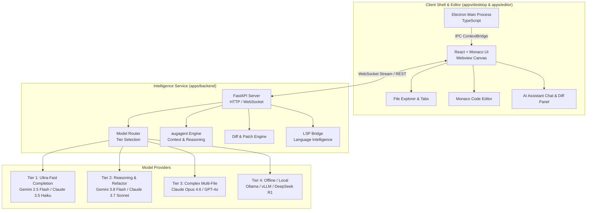

# AugHome IDE

<div align="center">

**An AI-native, open-source code editor powered by Augagent**

[](https://opensource.org/licenses/MIT)
[](https://github.com/Augmencord/AugHome)
[](https://github.com/Augmencord/augagent)
[](https://github.com/Augmencord/AugHome)

</div>

---

## 🌟 Overview

**AugHome IDE** is a modern, extensible, open-source code editor built from the ground up for deep AI integration. Powered by [`augagent`](https://github.com/Augmencord/augagent), AugHome integrates contextual multi-file reasoning, inline agentic code completion, unified diff visualization, and a local Language Server Protocol (LSP) bridge directly into a responsive developer workspace.

### Key Capabilities

- **AI-Native Context Engine**: Built-in AST-aware repository indexing and semantic symbol graph mapping powered by `augagent`.
- **Hybrid Local / Cloud Router**: Seamlessly routes tasks between ultra-fast local models (e.g., Ollama, vLLM) and leading frontier cloud models (Gemini, Claude, GPT-4o, DeepSeek).
- **Zero Lock-In Extensibility**: Standardized extension API compatible with Monaco editor themes, keymaps, and language packs.
- **Privacy First**: Configurable zero-data-retention local runtime ensuring full offline functionality.

---

## 🏗️ Architecture

AugHome is architected as an npm workspace monorepo decoupled into a native Electron shell, a React + Monaco rendering layer, and a Python FastAPI intelligence backend hosting `augagent`.



---

## 📊 Model Support Matrix

AugHome employs an intelligent tier-based routing strategy allowing developers to optimize for cost, latency, or maximum reasoning capability.

| Tier | Category | Recommended Models | Primary Use Cases | Streaming Latency |
| :--- | :--- | :--- | :--- | :--- |
| **Tier 1** | Ultra-Fast Inline | Gemini 2.5 Flash, Claude 3.5 Haiku, DeepSeek V3 | Tab completion, inline lint diagnostics, docstring auto-generation | `< 150ms` |
| **Tier 2** | Code Generation & Editing | Gemini 3.8 Flash, Claude 3.7 Sonnet, GPT-4o-mini | In-editor diff generation, single-file refactoring, unit test authoring | `< 400ms` |
| **Tier 3** | Deep Reasoning & Multi-File | Claude Opus 4.6, GPT-4o, DeepSeek R1 | Cross-repository architectural refactoring, complex bug hunting | `< 1200ms` |
| **Tier 4** | Local & Offline (Privacy) | Ollama (Qwen 2.5 Coder, Llama 3.3), vLLM | 100% offline, zero-cloud environments, proprietary enterprise codebases | Dependent on GPU |

---

## 📁 Monorepo Structure

```text
AugHome/
├── .github/
│   └── workflows/
│       └── ci.yml               # Automated build, lint, and test validation
├── apps/
│   ├── desktop/                 # Electron main process (TypeScript)
│   │   ├── src/                 # Main process and preload IPC scripts
│   │   ├── package.json
│   │   └── tsconfig.json
│   ├── editor/                  # React UI + Monaco Editor
│   │   ├── src/                 # Editor canvas, AI panels, components
│   │   ├── package.json
│   │   └── tsconfig.json
│   └── backend/                 # Python FastAPI + augagent service
│       ├── completion.py        # Inline completion pipeline
│       ├── diff_engine.py       # Unified diff computation & patch validation
│       ├── lsp_bridge.py        # Language Server Protocol bridge
│       ├── model_router.py      # Tiered model dispatcher
│       ├── server.py            # FastAPI entry point & API endpoints
│       ├── pyproject.toml       # Backend dependencies (augagent>=1.3.0)
│       └── tests/               # Backend unit test suite
├── extensions/                  # Bundled extensions and themes
├── docs/                        # Specifications, diagrams, and blueprints
├── package.json                 # Monorepo workspaces definition
├── LICENSE                      # MIT License
└── README.md                    # Project documentation
```

---

## 🚀 Getting Started

### Prerequisites

- **Node.js**: `v20.0.0` or higher
- **npm**: `v10.0.0` or higher
- **Python**: `3.10` or higher

> [!NOTE]
> Monorepo dependencies are structured for staged installation. Do not install root dependencies until initial workspace setup is verified.

### Backend Setup

```bash
cd apps/backend
pip install -e .
python server.py
```

### Editor & Desktop Setup

```bash
# From workspace root
npm install
npm run build
npm run dev
```

---

## 🤝 Contributing Guidelines

We welcome community contributions from developers, researchers, and designers!

### Workflow

1. **Fork the Repository**: Create your branch from `main` (`git checkout -b feature/amazing-feature`).
2. **Commit Imperative Messages**: Use the imperative mood (e.g., `Add completion streaming endpoint`, not `Added` or `Adding`).
3. **Keep Diffs Clean**: Aim to keep pull request diffs modular and focused under ~400 lines where practical.
4. **Automated Testing**: Every new feature or fix must include unit tests covering standard cases, edge conditions, and error states.
5. **Open a Pull Request**: Submit your PR targeting `main` with a clear explanation of changes and trade-offs.

---

## 📄 License

This project is licensed under the [MIT License](LICENSE).
